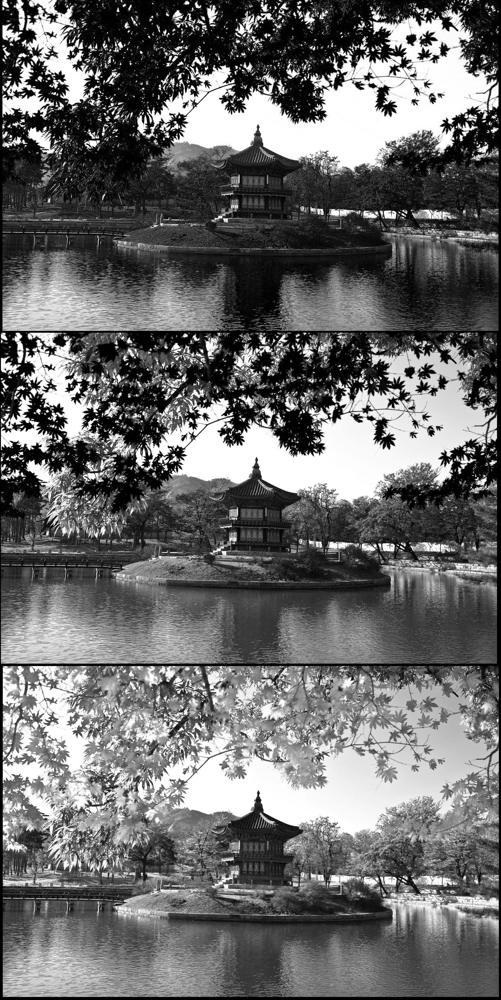
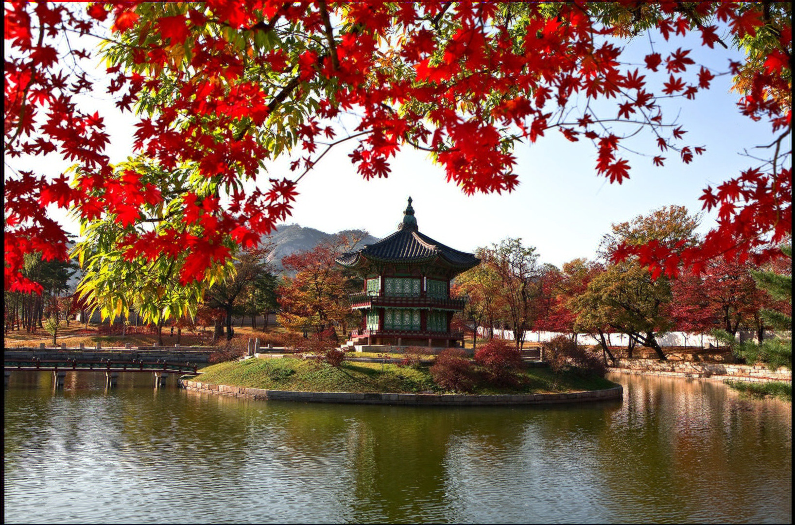

# Prokudin-Gorskii Image Colorization and Alignment  
**Reconstructing historic color images from grayscale triptychs** 

---

## 🔧 Implementation Steps  

### Step 1: Channel Extraction  
- **Input**: Grayscale triptych (e.g., `cathedral.jpg`)  
- **Process**:  
  - Vertically split into R (top), G (middle), B (bottom)  
  - Combine into misaligned RGB image  

### Step 2: Alignment  
- **Method**:  
  - Reference: **Red** channel (fixed)  
  - Search space: `[-15, 15]` pixels (x/y) for G and B  
  - Metric: **Normalized cross-correlation**  
- **Output**:  
  - Saved to `results/aligned/` with original filename  
  - Offsets printed (e.g., `G: (2,-5), B: (7,3)`)  

---

## Example Results

| Input | Output |
|-------|--------|
|  <br> *Vancouver Tableau* |  <br> *Aligned Result* |
|  <br> *Seoul Tableau* |  <br> *Aligned Result* |


---

## 🚀 Usage  
```bash
# Install dependencies
pip install numpy opencv-python matplotlib

# Run alignment
python main.py 